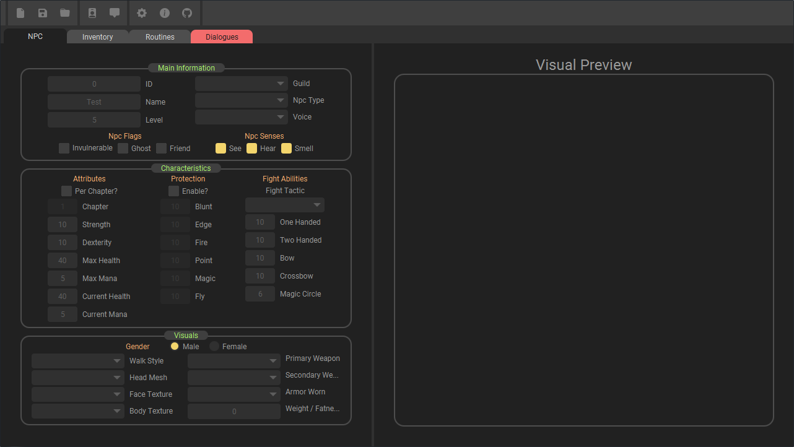
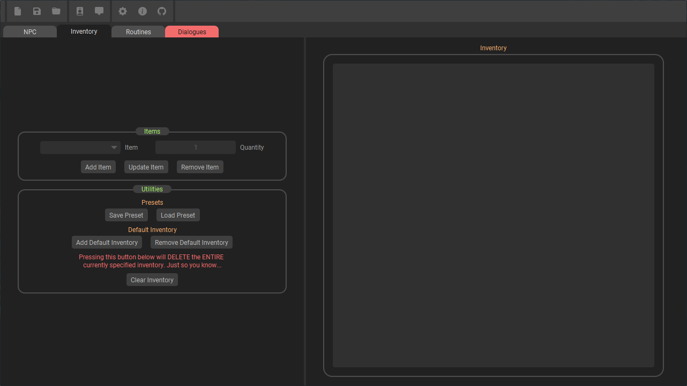
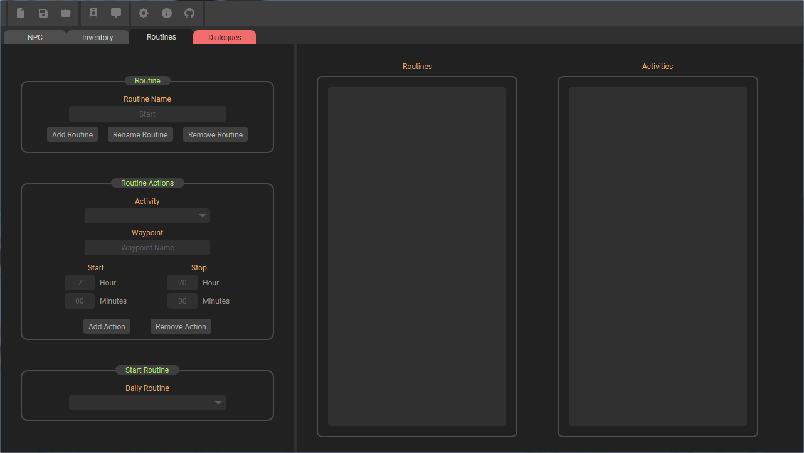

<!-- Shout out to byothneildrew for this amazing markdown template -->

<!-- PROJECT SHIELDS -->
[![Contributors][contributors-shield]][contributors-url]
[![Forks][forks-shield]][forks-url]
[![Stargazers][stars-shield]][stars-url]
[![Issues][issues-shield]][issues-url]
[![MIT License][license-shield]][license-url]


<!-- PROJECT LOGO -->
<br />
<p align="center">
  <a href="https://github.com/SandNoodle/GothicNPCTools">
    
  </a>

  <h3 align="center">Gothic NPC Tools</h3>

  <p align="center">
    Best NPC and Dialogue Maker for Gothic I / Gothic II !
    <br />
    <a href="https://github.com/SandNoodle/GothicNPCTools"><strong>Explore the docs »</strong></a>
    <br />
    <br />
    <a href="https://github.com/SandNoodle/GothicNPCTools">View Demo</a>
    ·
    <a href="https://github.com/SandNoodle/GothicNPCTools/issues">Report Bug</a>
    ·
    <a href="https://github.com/SandNoodle/GothicNPCTools/issues">Request Feature</a>
  </p>
</p>


<!-- TABLE OF CONTENTS -->
<details open="open">
  <summary><h2 style="display: inline-block">Table of Contents</h2></summary>
  <ol>
    <li><a href="#update">Important Update!</a></li>
    <li>
      <a href="#about-the-project">About The Project</a>
      <ul>
        <li><a href="#built-with">Built With</a></li>
      </ul>
    </li>
    <li>
      <a href="#getting-started">Getting Started</a>
      <ul>
        <li><a href="#prerequisites">Prerequisites</a></li>
        <li><a href="#installation">Installation</a></li>
      </ul>
    </li>
    <li><a href="#usage">Usage</a></li>
    <li><a href="#roadmap">Roadmap</a></li>
    <li><a href="#contributing">Contributing</a></li>
    <li><a href="#license">License</a></li>
    <li><a href="#contact">Contact</a></li>
    <li><a href="#acknowledgements">Acknowledgements</a></li>
  </ol>
</details>

## Update:

Project is currently being rewritten in C++ (with QT) due to no native integration of OpenGL in JavaFX library. Displaying 3D objects is very limited and comming up with a good solution is a time consuming process with no real benefit.
While testing the performance was really bad - from 4 FPS up to 20 FPS depending on the configuration.

<!-- ABOUT THE PROJECT -->
## About The Project

Due to the relative small size of gothic's modding community and lack of newbie friendly tools - this project focuses on developing easy-to-use NPC creator, which can streamline the whole process as fast and easy as possible.

 <a>
    
  </a>

### Built With

* [JavaFX](https://openjfx.io/)
* [Gson](https://github.com/google/gson)
* A bit of black magic.


<!-- GETTING STARTED -->
## Getting Started

To get a local copy up and running follow these simple steps.

### Prerequisites

Make sure you have installed:
* [JDK 14](https://adoptopenjdk.net/)
* [Maven](http://maven.apache.org/download.cgi)

### Installation

1. Clone the repo
   ```sh
   git clone https://github.com/SandNoodle/GothicNPCTools.git
   ```
2. Build the project
  ```sh
   mvn clean package
   ```
3. Specify Main Class in **MANIFEST.MF**
  ```sh
   java -cp target/GothicNPCTools-0.1.jar npctools.Main
   ```
4. Run the program
  ```sh
   java -jar GothicNPCTools-0.1.jar
   ```


### OR

1. Download latest release in the panel on the right (may be out of date!)
2. Extract all the  files to new folder, ex. **C:/GothicNPCTools/**
3. Run the program.
4. Follow pop-up instructions.


<!-- USAGE EXAMPLES -->
## Usage

To begin the process of creating your dream NPC, after downloading the program - follow these 3 simple steps.

First step is to fill the NPC Tab with some basic information like ID, Name, Guild, etc.

 
 <a>
    
 </a>

This tab contains all information about NPC's inventory.
(Excluding equipped weapons and armors - think of it as items in a backpack).


 <a>
    
 </a>

 Npc's everyday routine goes in here and every event based too!

 You add actions to **currently** selected routine.

  <a>
    
  </a>

  When you are done, click on the <svg xmlns="http://www.w3.org/2000/svg" width="16" height="16" fill="currentColor" class="bi bi-person-badge-fill" viewBox="0 0 16 16">
  <path d="M2 2a2 2 0 0 1 2-2h8a2 2 0 0 1 2 2v12a2 2 0 0 1-2 2H4a2 2 0 0 1-2-2V2zm4.5 0a.5.5 0 0 0 0 1h3a.5.5 0 0 0 0-1h-3zM8 11a3 3 0 1 0 0-6 3 3 0 0 0 0 6zm5 2.755C12.146 12.825 10.623 12 8 12s-4.146.826-5 1.755V14a1 1 0 0 0 1 1h8a1 1 0 0 0 1-1v-.245z"/>
</svg> icon - NPC file will be created in your modding directory.

  Don't worry if you are a little bit stuck - just hover your mouse above given field (Often great info can be found there).


<!-- ROADMAP -->
## Roadmap

See the [open issues](https://github.com/SandNoodle/GothicNPCTools/issues) for a list of proposed features (and known issues).


<!-- CONTRIBUTING -->
## Contributing

Contributions are what make the open source community such an amazing place to be learn, inspire, and create. Any contributions you make are **greatly appreciated**.

1. Fork the Project.
2. Create your Feature Branch (`git checkout -b feature/AmazingFeature`)
3. Commit your Changes (`git commit -m 'Add some AmazingFeature'`)
4. Push to the Branch (`git push origin feature/AmazingFeature`)
5. Open new Issue and describe your changes
6. Open a Pull Request and link it to your Issue.
 


<!-- LICENSE -->
## License

Distributed under the MIT License. See `LICENSE` for more information.


<!-- CONTACT -->
## Contact

At this point in time create new issue with **Type: Question** label related to this project.

**Project Link**: [GothicNPCTools](https://github.com/SandNoodle/GothicNPCTools)


<!-- ACKNOWLEDGEMENTS -->
## Acknowledgements

* [Img Shields](https://shields.io)
* [DaFont](https://www.dafont.com/)
* [Bootstrap Icons](https://icons.getbootstrap.com/)
* [Ioicons](https://ionicons.com/)
* [Material Design Icons](https://material.io/)


<!-- MARKDOWN LINKS & IMAGES -->
<!-- https://www.markdownguide.org/basic-syntax/#reference-style-links -->
[contributors-shield]: https://img.shields.io/github/contributors/SandNoodle/GothicNPCTools.svg?style=for-the-badge
[contributors-url]: https://github.com/SandNoodle/GothicNPCTools/graphs/contributors
[forks-shield]: https://img.shields.io/github/forks/SandNoodle/GothicNPCTools.svg?style=for-the-badge
[forks-url]: https://github.com/SandNoodle/GothicNPCTools/network/members
[stars-shield]: https://img.shields.io/github/stars/SandNoodle/GothicNPCTools.svg?style=for-the-badge
[stars-url]: https://github.com/SandNoodle/GothicNPCTools/stargazers
[issues-shield]: https://img.shields.io/github/issues/SandNoodle/GothicNPCTools.svg?style=for-the-badge
[issues-url]: https://github.com/SandNoodle/GothicNPCTools/issues
[license-shield]: https://img.shields.io/github/license/SandNoodle/GothicNPCTools.svg?style=for-the-badge
[license-url]: https://github.com/SandNoodle/GothicNPCTools/blob/master/LICENSE.md
